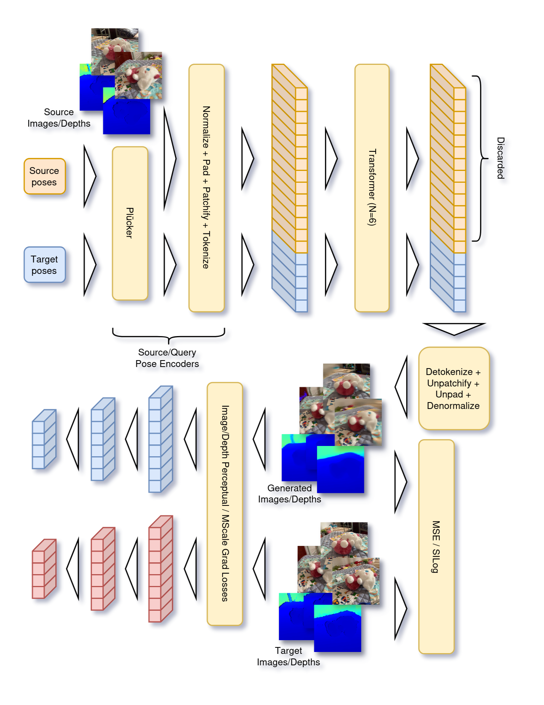

# View-Depth Synthesis Transformer: Um modelo baseado em Transformer para RGB-D Novel View Synthesis

| [English](README.md) | Português |

https://github.com/user-attachments/assets/35a33c5e-fd6a-473b-b55a-ea6f4a667a93

Essa é a implementação do modelo VDST, junto com o código para treiná-lo com os datasets usados originalmente.

Este é um modelo de RGB-D Novel View Synthesis, onde dadas um conjunto de visões de uma cena 3D com respectivos mapas de distâncias e propriedades/poses de câmera destas,
o modelo busca gerar uma nova visão com respectivo mapa de distância na cena, dadas as propriedades e pose da visão que se deseja gerar.

Esse modelo foi inspirado primariamente pela arquitetura e filosofia de [LVSM](https://haian-jin.github.io/projects/LVSM/),
onde ele aplica a mesma ideia central para a tarefa de Novel View Synthesis RGB-D.

Principais contribuições:

- A arquitetura (VDST);
- Uma variação da perda perceptual usando ConvNeXt no lugar de VGG-19;
- Uma perda perceptual para profundidade baseada em ConvNeXt com uma segunda CNN específica para estimar o campo receptivo e permitir usar máscaras de valores inválidos nos latentes da perda;
- Um pipeline de processamento de datasets de cenas RGB-D que permite isolar a avaliação de geração de conteúdo e interpolação de visões nas novas visões geradas.

Vantagens principais que esse modelo tem em comparação com outros métodos de NVS RGB-D:

- Devido à capacidade de generalização entre domínios de modelos baseados em Transformer, ele é capaz de:
  - Generalizar para cenas novas que seguem uma distribuição similar à dos dados originais de treino;
  - Realizar few-shot NVS, precisando de apenas duas imagens-fonte ou às vezes apenas uma na maioria dos casos para gerar novas visões;
- Seguindo a mesma abordagem de LVSM, nossa arquitetura também tenta minimizar o viés indutivo do modelo,
  e hipotetizamos que isso permite alcançar melhor resultados do que outros métodos quando treinado por períodos mais longos com quantidades suficientemente grandes de dados,
  apesar de não termos recursos computacionais suficientes para verificar isso, deixando tal investigação para trabalhos futuros;
- Ele pode ser treinado com recursos limitados sem divergir (o autor usou uma única RTX 4060 Ti com 8 GB de VRAM).

Principal limitação do modelo:
Esse modelo foi treinado sob restrições pesadas de recursos, onde, como afirmado anteriormente, tivemos apenas uma NVIDIA RTX 4060 Ti 8GB VRAM disponível para treinar o modelo, um ambiente mais restrito até que o de outros modelos de síntese conjunta de visão e profundidade generalizável treinados sob restrições de recursos, que comumente usam uma NVIDIA A100 80GB VRAM ou similar.
Isso nos forçou a usar um modelo bem menor em comparação com outros (nosso modelo tem 43.5M parâmetros, enquanto outros modelos como [LVSM](https://haian-jin.github.io/projects/LVSM/) ou [MVGD](https://mvgd.github.io/) têm em torno de 400-600M parâmetros), e nos impediu de treinar o modelo até convergência, o que causou ele a ainda ter alguns artefatos visuais.

### Resultados

Aqui estão alguns dos resultados do modelo depois de treinado com batch size 4 por 350000 iterações usando uma RTX 4060 Ti com 8GB de VRAM, durando em torno de 6 dias.

Número de parâmetros: 43.46M.

Métricas:

- Imagem:
  - PSNR: 19.72
  - SSIM: 0.588
  - LPIPS: 0.424
- Profundidade:
  - AbsRel: 0.0401
  - RMSE: 0.168
  - $\delta_{1}$: 0.971

Conjunto de validação:


Conjunto de teste:


Conjunto de teste nova categoria (categoria `truck`):


### Arquitetura



## Inferência

Os pesos do modelo treinado podem ser encontrados [aqui](https://huggingface.co/gammag7/vdst).

Nós também fizemos um renderizador que você pode usar para navegar nas cenas usando esse modelo, você pode encontrá-lo [aqui](https://github.com/gammag4/nvs_renderer).

## Dataset

Um script para baixar e processar o WildRGB-D dataset pode ser encontrado [aqui](https://github.com/gammag4/nvs_datasets).

O dataset foi dividido em quatro conjuntos:

- `train`: Usado para treinar o modelo;
- `val`: Usado para avaliar as métricas durante e no final do treino dos experimentos e escolher o melhor experimento;
- `test`: Usado para avaliar as métricas do modelo treinado final em cenas novas que não estavam nos conjuntos de treino ou validação;
- `test_new_category`: Usado para avaliar as métricas do modelo treinado final em cenas de uma categoria não usada durante o treino.

Os resultados dos três conjuntos de validação/teste escolhidos estão na pasta `final_results`, cujos resultados estão separados nos seguintes arquivos:

- `scenes.yaml`: Cenas usadas na avaliação quantitativa daquele conjunto;
- `scenes_rendered.yaml`: Cenas escolhidas daquele conjunto para serem renderizadas e usadas na avaliação qualitativa;
- `sources_n_val.png`: Imagens-fonte do batch n usado para avaliação qualitativa, cujas imagens são especificadas por `scenes_rendered.yaml`;
- `targets_0_val.png`: Renderizações das imagens-alvo do batch n usado para avaliação qualitativa, cujas imagens são especificadas por `scenes_rendered.yaml`;
- `eval_metrics.yaml`: Métricas finais da avaliação quantitativa (`snr_log` e `sqrt_snr_log` são apenas para debug, não são métricas reais).

## Treinamento

### Requisitos

Você precisa de:

- Alguma distribuição conda (recomendamos usar [Miniforge](https://conda-forge.org/download/))
- NVIDIA drivers com suporte para CUDA >= 13.0

### Baixando e processando datasets

Baixe e processe o dataset WildRGB-D usando o script disponibilizado para a pasta `datasets/wildrgbd`.

### Criando ambiente

Crie o ambiente Python e instale as dependências:

```sh
conda create -n vdst python=3.13
conda activate vdst
pip install -r requirements.txt
```

### Treinando o modelo

Rode o script de treino:

```bash
torchrun --standalone --nproc-per-node=gpu train.py --config config.yaml
```
