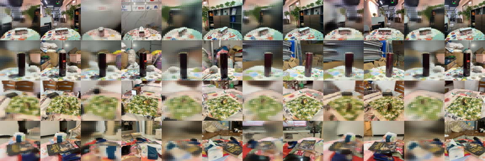
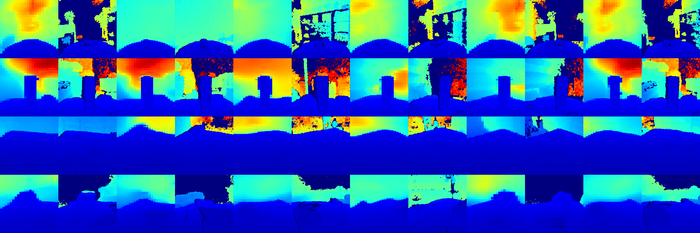

# View-Depth Synthesis Transformer: Um modelo baseado em Transformer para RGB-D Novel View Synthesis

| [English](README.md) | Português |




> [!NOTE]
> Esse modelo está atualmente em desenvolvimento/experimentação e não está completo ainda.
> Os resultados acima são de uma primeira run experimental (depois de treinar por dois dias em uma RTX 4060 Ti com 8GB vRAM).
> Mais detalhes sobre esses e outros experimentos podem ser encontrados [aqui](https://wandb.ai/gammag9-none/vdst/runs/ob9jxu15).

Essa é a implementação do modelo VDST, junto com o código para treiná-lo com os datasets usados originalmente.

Este é um modelo de RGB-D Novel View Synthesis, onde dadas um conjunto de visões de uma cena 3D com respectivos mapas de distâncias e propriedades/poses de câmera destas,
o modelo busca gerar uma nova visão com respectivo mapa de distância na cena, dadas as propriedades e pose da visão que se deseja gerar.

Nós propomos VDST para investigar a capacidade de modelos baseados em Transformer de resolver o problema de RGB-D Novel View Synthesis.
Esse tipo de arquitetura baseada em Transformer para Novel View Synthesis não é nova e não foi originalmente proposta por nós.
No nosso caso, nós nos baseamos principalmente na arquitetura do [LVSM](https://haian-jin.github.io/projects/LVSM/) e em sua filosofia,
embora existam outras arquiteturas similares também, sendo [SRT](https://srt-paper.github.io/) outro exemplo relevante.

Esse modelo possui duas vantagens principais em comparação com outros métodos:

- Devido à capacidade de generalização entre domínios de modelos baseados em Transformer, ele é capaz de generalizar para cenas novas que seguem uma distribuição similar à dos dados originais de treino;
- Seguindo a mesma filosofia do LVSM, nossa arquitetura também tenta minimizar o viés indutivo do modelo,
  e hipotetizamos que isso permite alcançar melhor resultados do que outros métodos quando treinado por períodos mais longos com quantidades suficientemente grandes de dados,
  apesar de não termos recursos computacionais suficientes para verificar isso, deixando tal investigação como trabalho futuro;
- Ele pode ser treinado com recursos limitados sem divergir (o autor usou uma única RTX 4060 Ti com 8 GB de VRAM).

## Treinamento

### Requisitos

Você precisa de:

- Alguma distribuição conda (recomendamos usar [Miniforge](https://conda-forge.org/download/))
- NVIDIA drivers com suporte para CUDA >= 13.0

### Baixando e processando datasets

Baixe e processe o dataset WildRGB-D usando o script disponibilizado [aqui](https://github.com/gammag4/nvs_datasets) para a pasta `datasets/wildrgbd`.

### Criando ambiente

Crie o ambiente Python e instale as dependências:

```sh
conda create -n vdst python=3.13
conda activate vdst
pip install -r requirements.txt
```

### Treinando o modelo

Rode o script de treino:

```bash
torchrun --standalone --nproc-per-node=gpu train.py --config config.yaml
```

## Renderizando

Nós também fizemos um renderizador que você pode usar para navegar nas cenas usando esse modelo, você pode encontrá-lo [aqui](https://github.com/gammag4/nvs_renderer).
